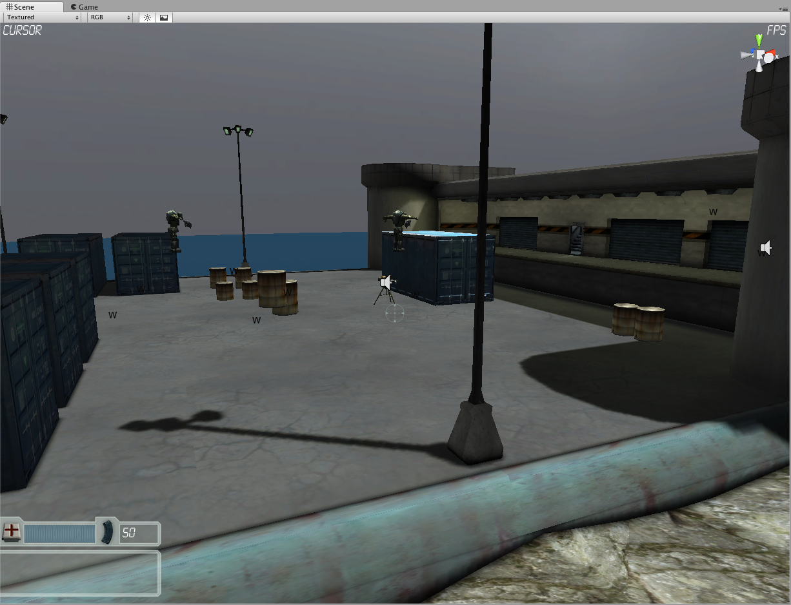

# Unity 2.6 FPS Tutorial Restored
The old Unity 2.6 FPS Tutorial sample project, now restored and enhanced for the modern day. **[Original Source](https://web.archive.org/web/20100102063856/http://unity3d.com/support/resources/tutorials/fpstutorial)**

# Comparisons

# Context

As a long-time Unity3D user *(since 3.0)*, I recall using and learning with many of the old resources and tutorials that Unity provided. As the engine evolved of course many of these resources quickly went out of date and are no longer available officially. Thankfully many of these have been fortunately archived in the Wayback Machine, and I decided to make the effort to restore/enhance these projects and "revive" them.

# Changes Made

It's worth noting that I did make an effort to keep the original integrity of the project visually and functionally. However, given that this project was made in the Unity 2.6 version, there have been of course many many additions and changes across the board to the entire engine and its API. So a lot of them were necessary to make, but also there were some things that I added/enhanced.

- **PROJECT:** Upgraded from Unity 2.6.1 to 2020.3.35f1
- **PROJECT:** Converted most of the scripts from UnityScript to C#.
- **PROJECT:** Added a custom Physics Audio implementation to play sounds on collision events.
- **PROJECT:** Added some sounds to the Health and Ammo pickups.
- **PROJECT:** UI has been reworked to leverage the new Unity UI system that was implemented to replace the legacy GUI system.
- **PROJECT:** Removed old visibility culling code to use the native Occlusion Culling System.
- **PROJECT:** Additionally removed a lot of old JS scripts that are not that useful anymore.
- **ART:** Enhanced original textures by AI upscaling, converted some of the old bump maps into normal maps, and used the standard shader over the legacy shaders.
- **ART:** Re-Lit the level and rebuilt lighting using the Progressive lightmapper *(original lightmaps are discarded)*
- **ART:** Utilizing the Post Processing Stack for post effects *(original image effects are discarded)*
- **ART:** Replaced old water shader with a new simple custom water shader *(old water shader is discarded)*
- **ART:** Particles have been rebuilt to utilize the native Shuriken Particle System.
- **CODE:** AI was mostly reworked to leverage the native NavMesh Pathfinding system implemented since Unity 3.5
- **CODE:** AI had a couple of additions to enhance its functionality. For visibility Field of View, and NavMesh Raycasting have been implemented for improved target visibility.
- **CODE:** Reworked Level Reloading/Switching to use the native SceneManagement API *(instead of the old Application.Level)*
- **LEVEL:** Reworked the level a bit to utilize all of the original assets, as well as adding more enemies and dynamic objects.
- **LEVEL:** Added a trigger at the end of the level, which triggers a sequence with a ship flying by. Entering it will effectively "end" the level.

### Why?
Mostly for historical/archival reasons, but also due to how complex sample projects and engines usually get now. I think these old Unity resource projects actually hold a lot of value for those who are learning, especially with how incredibly simple these old projects are. It's a lot less daunting to dive through, they are way smaller and more contained, and it's more accessible from a beginner's standpoint.

### Original Sources

**[Original Unity 2.6 FPS Tutorial Project](https://web.archive.org/web/20100102063856/http://unity3d.com/support/resources/tutorials/fpstutorial)**
